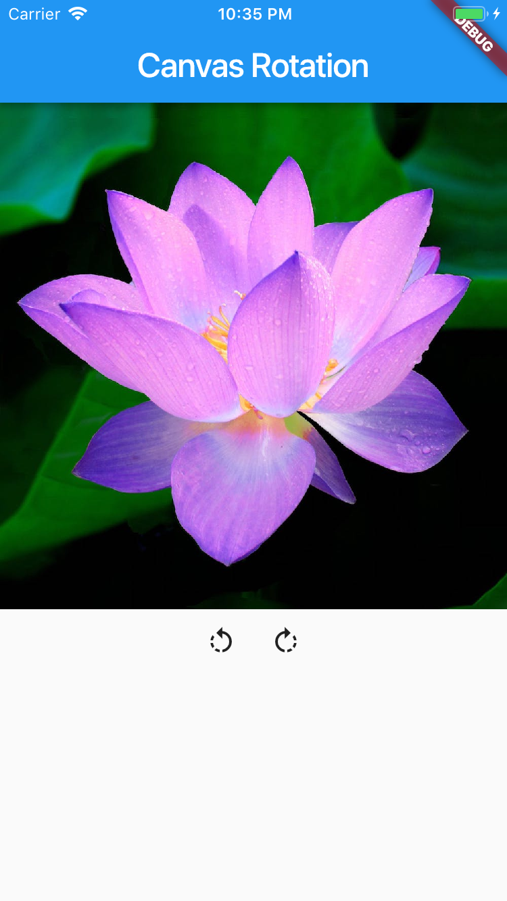
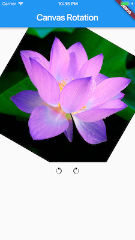

# canvas rotate demo
  

A simple Flutter app demonstrating how to draw an image into a canvas and rotate it.
By default the canvas.rotate method rotates around the top left corner.
This app provides some calculation to rotate the canvas around its center. The most relevant methods are:

###### Load image asset into ui.Image
```dart
Future<ui.Image> imageFromFilePath(String filePath) async {
  var byteData = await rootBundle.load(filePath);
  Uint8List lst = Uint8List.view(byteData.buffer);
  var codec = await ui.instantiateImageCodec(lst);
  var nextFrame = await codec.getNextFrame();
  return nextFrame.image;
}
```
###### Draw image and rotate the canvas
```dart
ui.Image rotatedImage({ui.Image image, double angle}) {
  var pictureRecorder = ui.PictureRecorder();
  Canvas canvas = Canvas(pictureRecorder);

  final double r =
      sqrt(image.width * image.width + image.height * image.height) / 2;
  final alpha = atan(image.height / image.width);
  final gama = alpha + angle;
  final shiftY = r * sin(gama);
  final shiftX = r * cos(gama);
  final translateX = image.width / 2 - shiftX;
  final translateY = image.height / 2 - shiftY;
  canvas.translate(translateX, translateY);
  canvas.rotate(angle);
  canvas.drawImage(image, Offset.zero, Paint());

  return pictureRecorder.endRecording().toImage(image.width, image.height);
}
```
